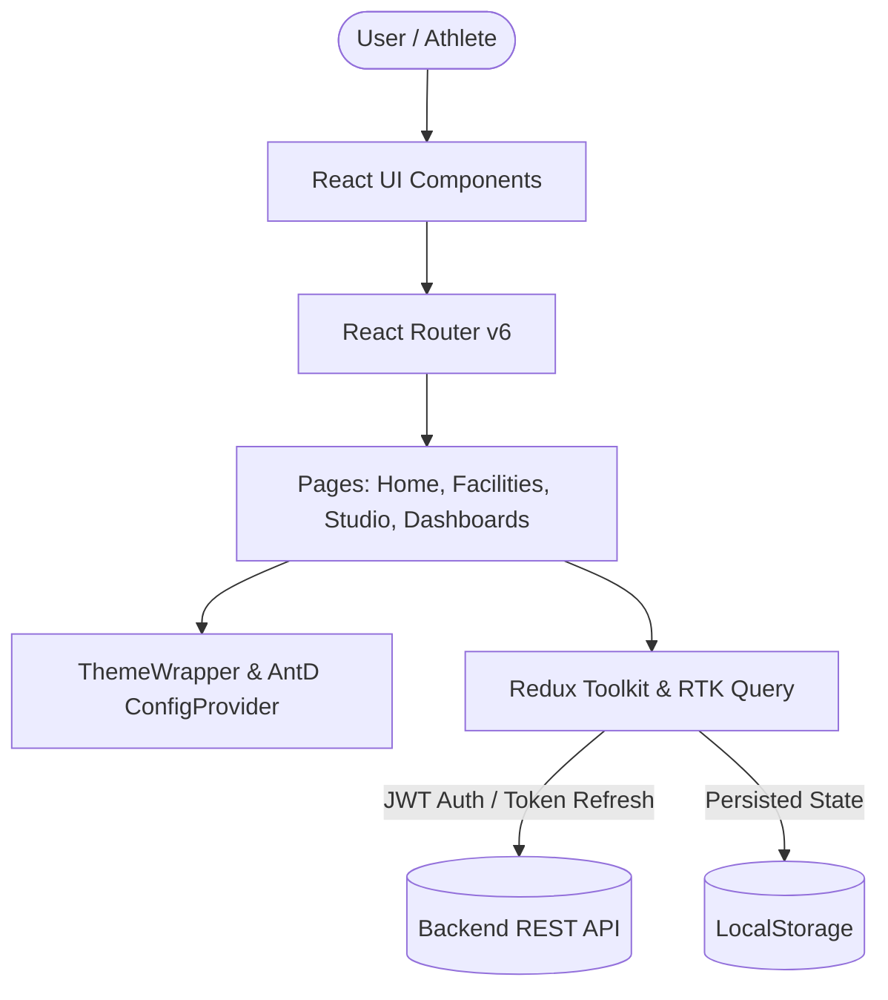

# 🏟️ Book My Court - Facility & Sports Booking Client

[](https://reactjs.org/)
[](https://vitejs.dev/)
[](https://www.typescriptlang.org/)
[](https://redux-toolkit.js.org/)
[](https://tailwindcss.com/)
[](https://ant.design/)

A modern, responsive, and feature-rich frontend application for discovering and booking premier sports courts and athletic venues.

---

## 🎨 UI Showcase & Architecture



---

## 🌟 Key Features

- **🌓 Dynamic Dark & Light Theme:** Persistent theme toggler smoothly synchronizing Ant Design algorithms (`darkAlgorithm` / `defaultAlgorithm`), Tailwind CSS dark classes, and custom glassmorphism styles.
- **🏟️ Court Booking Studio:** Live slot availability checker with interactive visual tags, automatic hourly pricing calculator, and pre-selection link integration.
- **💳 Celebration Payment Receipt:** Dedicated receipt page with interactive confetti animations, transaction breakdown, and receipt printing.
- **⭐ Player Reviews & Ratings:** Star rating badges, community feedback feed, and submission forms for authenticated members.
- **📊 Metric KPI Dashboards:** Custom analytics widgets for both Admin (revenue, facility counts, total bookings) and User (spent, confirmed slots).
- **🛡️ Protected Routes & Token Refresh:** Seamless role-based access protection with automatic silent token renewal.

---

## 📁 Project Structure

```
src/
├── assets/         # Images, icons, and Lottie animations
├── components/     # Reusable layout, form, and home section components
├── constants/      # Navigation links and global constants
├── pages/          # Application views (Facilities, Booking Studio, Dashboards, etc.)
├── redux/          # Store setup, RTK Query API injections, and slices
│   ├── api/        # Base RTK query configuration with token refresh
│   └── features/   # Auth, Theme, Facility, Booking, and Review slices
├── routes/         # React Router configuration with ProtectedRoute guards
├── types/          # Shared TypeScript type definitions
└── utils/          # Token verification and helper functions
```

---

## ⚙️ Environment Variables

Create a `.env` file in the root directory:

```env
VITE_API_URL=http://localhost:5000/api
```

---

## 🚀 Getting Started

### 1. Local Development
```bash
# Install dependencies
npm install

# Start Vite dev server
npm run dev

# Build for production
npm run build

# Preview build
npm run preview
```

### 2. Docker Deployment
```bash
# Build Docker image
docker build -t book-my-court-client .

# Run container
docker run -p 80:80 book-my-court-client
```
